# Architecture

## Pipeline Overview

```mermaid
graph TB
    Input["tools.json<br/>(OpenAI-compatible tool definitions)"] --> Sampling["🎲 Tool Sampling<br/>---<br/>• Random<br/>• Param-aware<br/>• Semantic"]

    Sampling --> ProbGen["🤖 Problem Generation<br/>(LLM Role 1)<br/>---<br/>Generate natural language<br/>user requests"]

    ProbGen --> ToolCall["🔧 Tool Call Generation<br/>(LLM Role 2)<br/>---<br/>Generate structured<br/>tool calls with arguments"]

    ToolCall --> Judge["⚖️ Quality Evaluation<br/>(LLM Role 3 - Judge)<br/>---<br/>• Tool Relevance (0-0.4)<br/>• Argument Quality (0-0.4)<br/>• Clarity (0-0.2)<br/>Verdict: accept ≥ 0.7"]

    Judge --> Output["📦 Output Generation<br/>---<br/>• train.jsonl / val.jsonl<br/>• manifest.json"]

    style Input fill:#e1f5ff,stroke:#333,stroke-width:2px,color:#000
    style Sampling fill:#fff4e1,stroke:#333,stroke-width:2px,color:#000
    style ProbGen fill:#f0e1ff,stroke:#333,stroke-width:2px,color:#000
    style ToolCall fill:#e1ffe1,stroke:#333,stroke-width:2px,color:#000
    style Judge fill:#ffe1e1,stroke:#333,stroke-width:2px,color:#000
    style Output fill:#f5f5f5,stroke:#333,stroke-width:2px,color:#000
```

## Core Components

### 1. Schema Layer (`schema.py`)
Defines the data structures using Pydantic models:
- `ToolSpec`: OpenAI-compatible tool definitions
- `Message`: Chat message format (user, assistant, system, tool)
- `AssistantToolCall`: Structured tool call with function name and arguments
- `Record`: Complete dataset record with metadata and judge scores

### 2. Sampling Module (`sampling.py`)
Implements three sampling strategies for tool subset selection:
- **Random**: Uniform sampling without replacement
- **Param-aware**: Prioritizes tools with more parameters to encourage richer examples
- **Semantic**: Groups tools by keyword similarity for contextually related subsets

### 3. Core Generation (`core.py`)
Orchestrates the multi-stage generation process:
- Configuration classes (GenerationConfig, ModelConfig, RoleBasedModelConfig)
- Tool spec loading and validation
- OpenAI client management with structured outputs
- Sample generation (user requests + tool calls + judge evaluation)
- JSONL writer functions for output
- Train/val dataset splitting

### 4. Judge System (`judge.py`)
Implements LLM-as-a-judge evaluation:
- **Rubric-based scoring** across three dimensions
- **Structured outputs** using Pydantic for reliable parsing
- **Configurable thresholds** for accept/reject decisions
- **Rationale generation** for transparency

### 5. CLI Interface (`cli.py`)
Command-line interface built with argparse (Python stdlib):
- `version`: Display version information
- `generate`: Run dataset generation with full configuration options
- Entry point available as `toolsgen` command after installation

## Implementation Scope

### What ToolsGen Does

✅ **Dataset Generation**
- Generates synthetic tool-calling datasets from tool definitions
- Produces realistic user requests that require tool usage
- Creates structured tool calls with plausible arguments
- Evaluates quality using multi-dimensional rubrics

✅ **Quality Control**
- LLM-as-a-judge scoring with configurable thresholds
- Automatic retry on low-quality samples
- Detailed metadata and statistics in manifest files

✅ **Flexibility**
- Multiple sampling strategies for diverse datasets
- Role-based model configuration (use different models for different tasks)
- Train/val splitting for ML workflows
- OpenAI-compatible API support (works with various providers)

✅ **Developer Experience**
- Python API and CLI interface
- Type-safe configuration with Pydantic
- Comprehensive test suite (pytest with coverage)
- Pre-commit hooks for code quality

### What ToolsGen Does NOT Do

- ❌ **Model Training**: ToolsGen generates datasets but does not train models
- ❌ **Tool Execution**: Generated tool calls are not executed; this is a dataset generator
- ❌ **Multi-turn Conversations**: Currently focuses on single-turn user requests
- ❌ **Custom Prompt Engineering**: Uses predefined prompt templates (customization requires code changes)
- ❌ **Distributed Generation**: Runs on a single machine (no built-in distributed processing)
- ❌ **Real-time API**: Designed for batch dataset generation, not real-time inference
