# ToolsGen

A modular Python library for synthesizing tool-calling datasets from JSON tool definitions using an LLM-as-a-judge pipeline. Designed for OpenAI-compatible APIs.

> **⚠️ Development Status**: This project is under active development. The API is not yet stable and may undergo significant changes. Breaking changes may occur between versions.

## Overview

ToolsGen automates the creation of tool-calling datasets for training and evaluating language models. It generates realistic user requests, produces corresponding tool calls, and evaluates their quality using a multi-dimensional rubric system.

### Key Features

- **Multi-role LLM Pipeline**: Separate models for problem generation, tool calling, and quality evaluation
- **Flexible Sampling Strategies**: Random, parameter-aware, and semantic clustering approaches
- **LLM-as-a-Judge Scoring**: Rubric-based evaluation with structured outputs
- **OpenAI-Compatible**: Works with OpenAI API and compatible providers (Azure OpenAI, local models via vLLM, etc.)
- **Hugging Face Ready**: JSONL output format compatible with Hugging Face datasets
- **Configurable Quality Control**: Adjustable scoring thresholds and retry mechanisms
- **Train/Val Splitting**: Built-in dataset splitting for model training workflows

## Installation

```bash
# Recommended: Use uv for fast dependency management
uv venv
. .venv/Scripts/activate  # Windows PowerShell: .venv\Scripts\Activate.ps1
uv pip install -r requirements.txt

# For development (includes testing and linting tools)
uv pip install -r requirements-dev.txt
```

## Configuration

Create a `.env` file in the project root with your OpenAI API key:

```bash
# Copy the example file
cp .env.example .env

# Edit .env and add your API key
OPENAI_API_KEY=sk-your-actual-api-key-here
```

Or set the environment variable directly:
```bash
export OPENAI_API_KEY="your-api-key-here"  # Linux/macOS
$env:OPENAI_API_KEY="your-api-key-here"    # Windows PowerShell
```

## Usage

### CLI Usage

```bash
# Check version
python -m toolsgen.cli version

# Generate dataset with default settings
python -m toolsgen.cli generate \
  --tools tools.json \
  --out output_dir \
  --n 100

# Advanced: Use different models for different roles
python -m toolsgen.cli generate \
  --tools tools.json \
  --out output_dir \
  --n 1000 \
  --strategy param_aware \
  --seed 42 \
  --model gpt-4o-mini \
  --train-split 0.9
```

### Python API Usage

```python
from pathlib import Path
from dotenv import load_dotenv
from toolsgen.config import GenerationConfig, ModelConfig
from toolsgen.generator import generate_dataset

load_dotenv()

# Configuration
tools_path = Path("tools.json")
output_dir = Path("output")

gen_config = GenerationConfig(
    num_samples=100,
    strategy="random",
    seed=42,
    train_split=0.9,  # 90% train, 10% validation
)

model_config = ModelConfig(
    model="gpt-4o-mini",
    temperature=0.7,
)

# Generate dataset
manifest = generate_dataset(tools_path, output_dir, gen_config, model_config)

print(f"Generated {manifest['num_generated']}/{manifest['num_requested']} records")
print(f"Failed: {manifest['num_failed']} attempts")
```

See `examples/` directory for complete working examples.

## Output Format

### Dataset Files (JSONL)

Each line in `train.jsonl` (or `val.jsonl`) is a JSON record:

```json
{
  "id": "record_000001",
  "language": "english",
  "tools": [...],
  "messages": [
    {"role": "user", "content": "What's the weather in San Francisco?"}
  ],
  "assistant_calls": [
    {
      "id": "call_abc123",
      "type": "function",
      "function": {
        "name": "get_weather",
        "arguments": "{\"location\": \"San Francisco, CA\"}"
      }
    }
  ],
  "problem_metadata": {"generated": true, "user_request": "..."},
  "judge": {
    "tool_relevance": 0.4,
    "argument_quality": 0.38,
    "clarity": 0.2,
    "score": 0.98,
    "verdict": "accept",
    "rationale": "Excellent tool selection and argument quality",
    "rubric_version": "0.1.0",
    "model": "gpt-4o",
    "temperature": 0.0
  },
  "quality_tags": []
}
```

### Manifest File

`manifest.json` contains generation metadata:

```json
{
  "version": "0.1.0",
  "num_requested": 1000,
  "num_generated": 987,
  "num_failed": 13,
  "strategy": "param_aware",
  "seed": 42,
  "train_split": 0.9,
  "tools_count": 15,
  "models": {
    "problem_generator": "gpt-4o-mini",
    "tool_caller": "gpt-4o",
    "judge": "gpt-4o"
  },
  "splits": {
    "train": 888,
    "val": 99
  }
}
```

## Testing

```bash
# Run all tests with coverage
pytest --cov=src

# Run specific test file
pytest tests/test_generator.py

# Run with verbose output
pytest -v
```

## Development

### Pre-commit Hooks

Install development tools and enable hooks:

```bash
uv pip install -r requirements-dev.txt
pre-commit install
```

Run hooks on all files:

```bash
pre-commit run --all-files
```

Hooks included:
- **Code formatting**: black, pyupgrade
- **Linting**: flake8, ruff (with auto-fix)
- **Type checking**: mypy
- **File hygiene**: trailing whitespace, EOF fixer, YAML/JSON validation


## Architecture

### Pipeline Overview

```mermaid
graph TB
    Input["tools.json<br/>(OpenAI-compatible tool definitions)"] --> Sampling["🎲 Tool Sampling<br/>---<br/>• Random<br/>• Param-aware<br/>• Semantic"]

    Sampling --> ProbGen["🤖 Problem Generation<br/>(LLM Role 1)<br/>---<br/>Generate natural language<br/>user requests"]

    ProbGen --> ToolCall["🔧 Tool Call Generation<br/>(LLM Role 2)<br/>---<br/>Generate structured<br/>tool calls with arguments"]

    ToolCall --> Judge["⚖️ Quality Evaluation<br/>(LLM Role 3 - Judge)<br/>---<br/>• Tool Relevance (0-0.4)<br/>• Argument Quality (0-0.4)<br/>• Clarity (0-0.2)<br/>Verdict: accept ≥ 0.7"]

    Judge --> Output["📦 Output Generation<br/>---<br/>• train.jsonl / val.jsonl<br/>• manifest.json"]

    style Input fill:#e1f5ff,stroke:#333,stroke-width:2px,color:#000
    style Sampling fill:#fff4e1,stroke:#333,stroke-width:2px,color:#000
    style ProbGen fill:#f0e1ff,stroke:#333,stroke-width:2px,color:#000
    style ToolCall fill:#e1ffe1,stroke:#333,stroke-width:2px,color:#000
    style Judge fill:#ffe1e1,stroke:#333,stroke-width:2px,color:#000
    style Output fill:#f5f5f5,stroke:#333,stroke-width:2px,color:#000
```



### Core Components

#### 1. Schema Layer (`schema.py`)
Defines the data structures using Pydantic models:
- `ToolSpec`: OpenAI-compatible tool definitions
- `Message`: Chat message format (user, assistant, system, tool)
- `AssistantToolCall`: Structured tool call with function name and arguments
- `Record`: Complete dataset record with metadata and judge scores

#### 2. Sampling Module (`sampling.py`)
Implements three sampling strategies for tool subset selection:
- **Random**: Uniform sampling without replacement
- **Param-aware**: Prioritizes tools with more parameters to encourage richer examples
- **Semantic**: Groups tools by keyword similarity for contextually related subsets

#### 3. Generation Pipeline (`generator.py`)
Orchestrates the multi-stage generation process:
1. Loads and validates tool specifications
2. Creates separate LLM clients for each role
3. Samples tool subsets according to strategy
4. Generates user requests, tool calls, and evaluations
5. Handles retries and failure tracking
6. Outputs JSONL datasets with optional train/val splitting

#### 4. Judge System (`judge/scorer.py`)
Implements LLM-as-a-judge evaluation:
- **Rubric-based scoring** across three dimensions
- **Structured outputs** using Pydantic models for reliable parsing
- **Configurable thresholds** for accept/reject decisions
- **Rationale generation** for transparency

#### 5. Provider Abstraction (`providers/openai_compat.py`)
OpenAI-compatible client with production features:
- Retry logic with exponential backoff
- Rate limiting using token bucket algorithm
- Structured outputs support for reliable JSON parsing
- Environment-based API key management

#### 6. Configuration System (`config.py`)
Type-safe configuration using dataclasses:
- `GenerationConfig`: Runtime parameters (samples, strategy, seed, splits)
- `ModelConfig`: Model-specific settings (model name, temperature, base URL)
- `RoleBasedModelConfig`: Different models for different pipeline roles

#### 7. CLI Interface (`cli.py`)
Command-line interface built with Typer:
- `version`: Display version information
- `generate`: Run dataset generation with full configuration options

## Implementation Scope

### What ToolsGen Does

✅ **Dataset Generation**
- Generates synthetic tool-calling datasets from tool definitions
- Produces realistic user requests that require tool usage
- Creates structured tool calls with plausible arguments
- Evaluates quality using multi-dimensional rubrics

✅ **Quality Control**
- LLM-as-a-judge scoring with configurable thresholds
- Automatic retry on low-quality samples
- Detailed metadata and statistics in manifest files

✅ **Flexibility**
- Multiple sampling strategies for diverse datasets
- Role-based model configuration (use different models for different tasks)
- Train/val splitting for ML workflows
- OpenAI-compatible API support (works with various providers)

✅ **Developer Experience**
- Python API and CLI interface
- Type-safe configuration with Pydantic
- Comprehensive test suite (pytest with coverage)
- Pre-commit hooks for code quality

### What ToolsGen Does NOT Do

❌ **Model Training**: ToolsGen generates datasets but does not train models
❌ **Tool Execution**: Generated tool calls are not executed; this is a dataset generator
❌ **Multi-turn Conversations**: Currently focuses on single-turn user requests
❌ **Custom Prompt Engineering**: Uses predefined prompt templates (customization requires code changes)
❌ **Distributed Generation**: Runs on a single machine (no built-in distributed processing)
❌ **Real-time API**: Designed for batch dataset generation, not real-time inference

## Roadmap

### Planned Features
- [ ] Multi-turn conversation support
- [ ] Custom prompt template system
- [ ] Parallel generation with multiprocessing
- [ ] Additional sampling strategies (coverage-based, difficulty-based)
- [ ] Integration with Hugging Face Hub for direct dataset uploads
- [ ] Support for more LLM providers (Anthropic, Cohere, etc.)
- [ ] Web UI for dataset inspection and curation
- [ ] Advanced filtering and deduplication

### Known Limitations
- Single-turn conversations only
- English-focused prompts (multilingual support is experimental)
- No built-in tool execution or validation
- Limited to OpenAI-compatible APIs

## Contributing

Contributions are welcome! Please note that the API is still evolving. Before starting major work, please open an issue to discuss your proposed changes.

## License

MIT License - see [LICENSE](LICENSE) for details.

## Citation

If you use ToolsGen in your research, please cite:

```bibtex
@software{toolsgen2024,
  title = {ToolsGen: Synthetic Tool-Calling Dataset Generator},
  author = {Ataşoğlu, Ahmet},
  year = {2024},
  url = {https://github.com/atasoglu/toolsgen}
}
```

## Acknowledgments

- Built with [OpenAI API](https://platform.openai.com/)
- Inspired by the tool-calling capabilities of modern LLMs
- Uses [Pydantic](https://docs.pydantic.dev/) for data validation
- CLI powered by [Typer](https://typer.tiangolo.com/)
